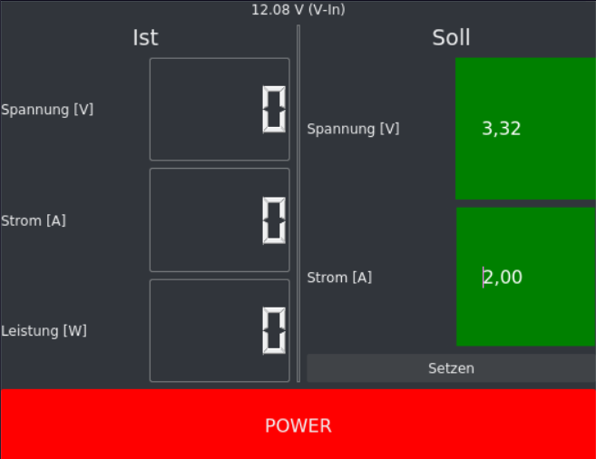

 
# PyDPS
Linux GUI for all DPS variable power supplies with USB or Bluetooth connection.

## Dependencies
> sudo pip3 install minimalmodbus

> sudo pip3 install pyqt5

(Optional for plot)
> sudo pip3 install pyqtgraph numpy

## HowTo
- Modify config.json:
	- "dev_init_command": OS-Command to connect to device
		- You will need your Device-MAC-Adress for bluetooth connection
		- If you're using USB, you may leave this blank and just set the correct "dev_path". This may vary for different linux distributions
	- "dev_path": Set directory, where the device is mounted
	- Leave anything else (you can change "update_rate", which sets GUI-update-rate)
- Run the following command:

> python3 pyQtDPS.py
- You may need to run as root for read/write privileges:

> sudo python3 pyDPS.py

